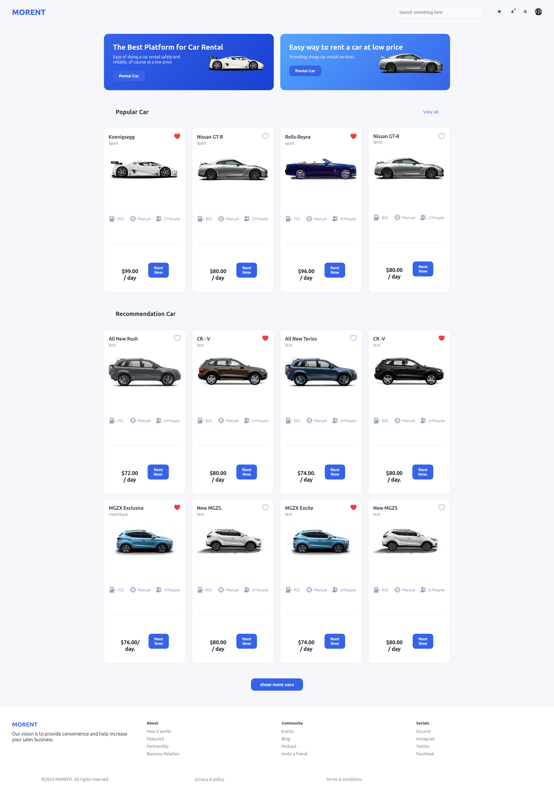

# Figma Car Rent 

Preview

## About

Figma Car Rent page  is a responsive frontend project built from a Figma design.
The goal of this project is to accurately replicate the provided UI design while maintaining clean code structure and responsiveness.

This project demonstrates:

Proper semantic HTML structure

Responsive layout using CSS

Design File

The original design can be found here:
Figma Design [https://www.figma.com/design/PB6gdHlUaagtwNG5MgDR5g/Car-Rent-Website-Design---Pickolab-Studio--Community-?node-id=1-5&p=f&t=8PFVwOKl5HDgk8ZC-0]

## Built With

HTML

CSS3

CSS Grid

Prerequisites

To understand and work on this project, you should have:

Basic knowledge of HTML

Basic knowledge of CSS

Understanding of CSS Grid

Basic Git & GitHub knowledge

Clone Project

To get a local copy up and running follow these simple steps:

Clone this repository using your terminal or command-line:

[https://github.com/ChiaEndu/Final-HTML-project]

Change to the project directory:

cd Final-HTML-project

Command-Line Steps

$ git clone [https://github.com/ChiaEndu/Final-HTML-project]

$ cd Final-HTML-project

$ git checkout main

Start App

Open the project folder

Open index.html in your browser

Or use Live Server if you are using VS Code.

This project was tested for

Responsive behavior on different screen sizes

Author

Chia

GitHub: @ChiaEndu

LinkedIn: Chia Endurance